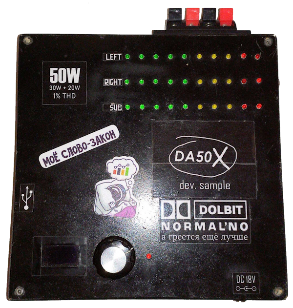

# Аудиоусилитель DA50X
a.k.a. "~~Цифровая~~ акустическая система с открытым исходным кодом"
[Click here to see English version](README_en.md)

> Проект основан на моих детских фантазиях из 2017 года и собран макетом. Не следует воспринимать всё всерьёз. При желании вы можете собрать его по приложенной схеме, собрать исходный код и загрузить его в Arduino, либо использовать часть исходного кода в своих проектах (например, реализацию вывода многостраничного меню на OLED-дисплей).

Сторонние библиотеки by [AlexGyver](https://github.com/GyverLibs)

## Характеристики
- Выходная мощность: 2x15 Вт на нагрузку 8Ω
- Выход на сабвуфер *(не готов)*
- Подключение звука через USB и Bluetooth
- Удалённое управление через приложение (в т.ч. через Bluetooth SPP)

### Дополнительные особенности
- **Оптимизация прошивки (минимум сторонних библиотек и оригинальных Arduino-функций, работа с регистрами и прерываниями PCINT)**
- Интерфейс с OLED-дисплем и единственным энкодером управления
- Русский и английский языки интерфейса
- Контроль температуры радиатора усилителя
- Возможность питания только от USB-разъема ("*DAC-only mode*" для использования устройства в качестве звуковой карты)
- ~~ну и просто осуществление детской мечты~~


### Чек-листы
#### Стадии реализации
- [X] Поддержка USB-аудио
- [X] Поддержка Bluetooth-аудио
- [ ] \(Optional) Поддержка FM-радио
- [ ] \(Optional) Поддержка USB-накопителей и карт памяти
- [ ] Вход AUX
- [ ] Вход для микрофона
- [X] Индикаторы уровня
- [X] Поддержка удалённого управления (Bluetooth SPP + USB UART)
- [ ] ПО удалённого управления
- [ ] Выход на сабвуфер

#### Исправления ошибок
- [X] Фоновый шум Bluetooth
- [X] Фоновый шум USB[^1]
- [ ] Отсутствие буферного ОУ на линейном выходе[^2]
- [ ] Побочное свечение первых светодиодов индикаторов

## Конфигурация
См. файл `src/config.h`.
```cpp
#define RUSSIAN                             // компилировать прошивку с русским языком интерфейса
#define CTRL_HOLD_TIMEOUT_MS 500            // время удержания кнопки энкодера перед срабатыванием триггера удержания
#define ACT_AUTOCLOSE_TIMEOUT_MS 1500       // таймаут возврата с экрана действия на главный экран (например, после изменения громкости)
#define BT_AUTOCONNECT_TIMEOUT_MS 11500     // таймаут ожидания автоматического подключения спаренного с DA50X устройства Bluetooth
#define DISP_AUTO_DIMM_TIMEOUT_MS 15000     // таймаут автоматического снижения яркости дисплея
#define TEMP_REFRESH_INTERVAL_MS 2000       // интервал обновления данных с датчика температуры
#define QUICK_VOLUME_ACTIVATE_MS 40         // интервал между тактами энкодера, при котором сработает "быстрая регулировка громкости"
#define UNDERVOLT_CHECK_MS 500              // интервал обновления информации о наличии проблем с питанием
#define TEMP_MAX_WARNING 69                 // максимальная температура перед предупреждением о перегреве
#define INIT_VOLUME 25                      // начальное значение громкости при запуске
```

[^1]: решается правильной разводкой цепей GND - наличием дополнительного проводника между землёй USB-порта и землёй разъема питания
[^2]: приводит к появлению помех, просадке низких частот и общей громкости при подключении чего-либо к линейному выходу