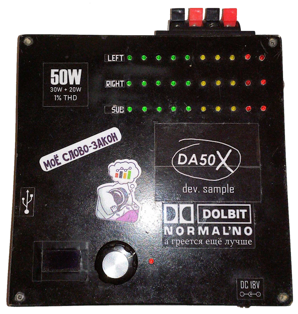

# DA50X Audio Amplifier

> This project is based just on my childhood dreams. Don't take everything seriously. If you wish, you can assemble the "DA50X" by included schematic and by compiling source code and uploading it to Arduino. Otherwise, you can use a part of my source code in your projects (like OLED-display scrolling menu implementation).

Third-party libraries by [AlexGyver](https://github.com/GyverLibs)

## Specifications
- Main output power: 2x15W at 8Ω load
- Subwoofer output *(not implemented yet)*
- Audio over USB and Bluetooth
- Remote control via application (wireless control by Bluetooth SPP included)

### Features
- **Firmware optimization (some of third-party libraries are excluded, working with registers and PCINT interruptions is also used)**
- OLED-display GUI and single control encoder
- Russian and English GUI language
- Amplifier's heatsink temperature monitoring
- Can be powered without PSU by USB 5V (only for *DAC-only mode* just for using DA50X as a sound card)


### Checklists
#### Implementations
- [X] USB Audio support
- [X] Bluetooth Audio support
- [ ] \(Optional) FM-radio support
- [ ] \(Optional) USB Disk and TF-card support
- [ ] AUX input
- [ ] Microphone input
- [X] Audio level monitoring indicators
- [X] Remote control support (via Bluetooth SPP or USB UART)
- [ ] Remote control software
- [ ] Subwoofer output

#### Fixes
- [X] Bluetooth audible noise
- [X] USB audible noise[^1]
- [ ] Missing buffer OpAmp at the line out[^2]
- [ ] Side glow of the first LEDs at the level indicators

## Configuration
See `src/config.h`.
```cpp
#define RUSSIAN                             // complie firmware with Russian UI language
#define CTRL_HOLD_TIMEOUT_MS 500            // encoder hold timeout before triggering
#define ACT_AUTOCLOSE_TIMEOUT_MS 1500       // return from action to main screen timeout (e.g. after volume change)
#define BT_AUTOCONNECT_TIMEOUT_MS 11500     // Bluetooth autoconnect timeout (with already paried devices)
#define DISP_AUTO_DIMM_TIMEOUT_MS 15000     // OLED display dimming timeout (when user is inactive)
#define TEMP_REFRESH_INTERVAL_MS 2000       // heatsink temperature refresh interval
#define QUICK_VOLUME_ACTIVATE_MS 40         // interval between encoder ticks for quick volume chaning activation
#define UNDERVOLT_CHECK_MS 500              // undervoltage detection refresh interval
#define TEMP_MAX_WARNING 69                 // maximum heatsink temperature before warning
#define INIT_VOLUME 25                      // set this volume level when device (re)starts
```

[^1]: can be fixed by correct GND wiring (adding a wire between USB GND and power GND can explain this issue)
[^2]: without this, plugging another device to line out would result in volume and bass drop or making an additional noise in speakers